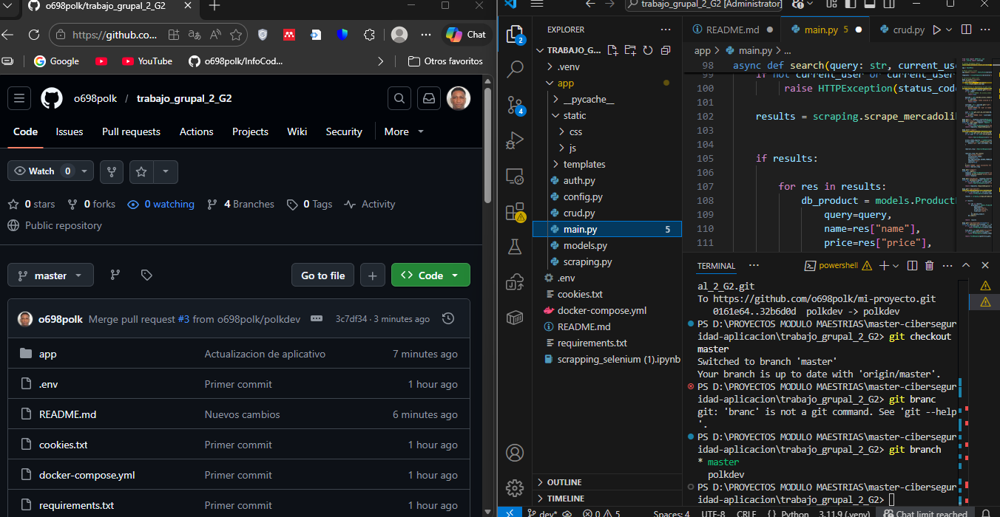
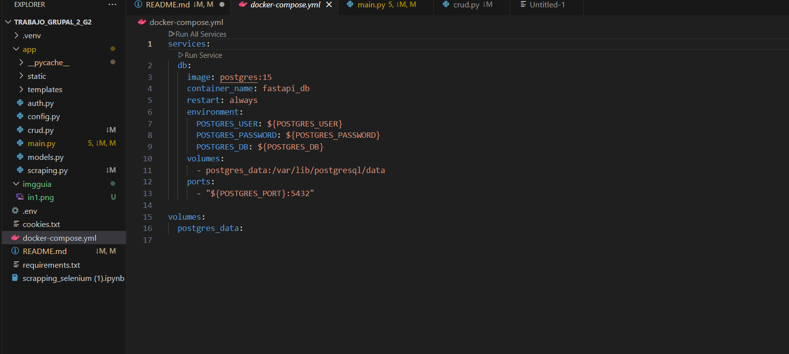
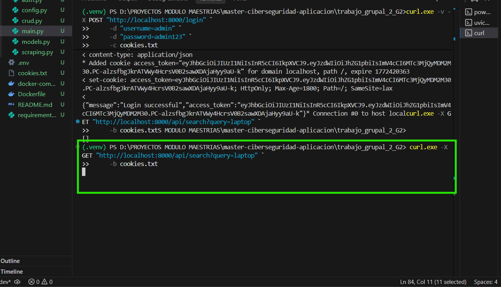
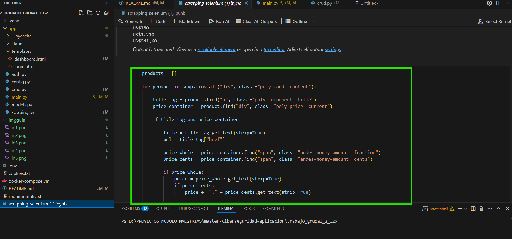
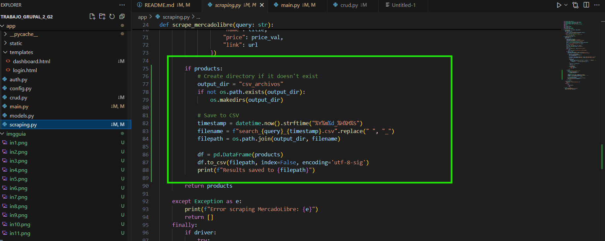
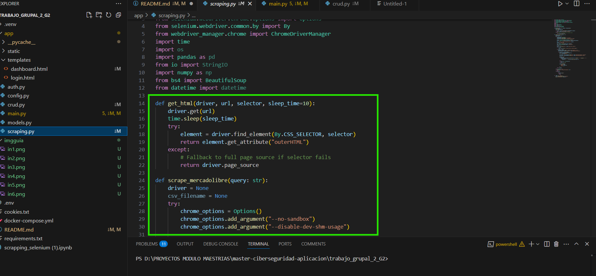
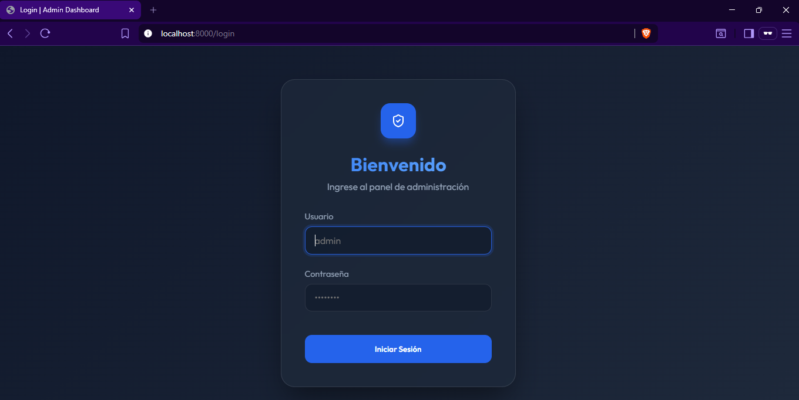
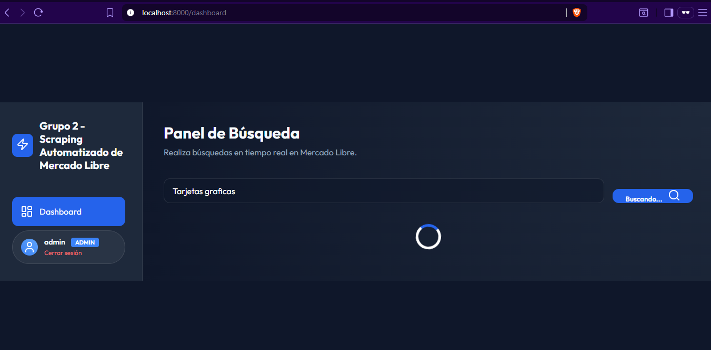
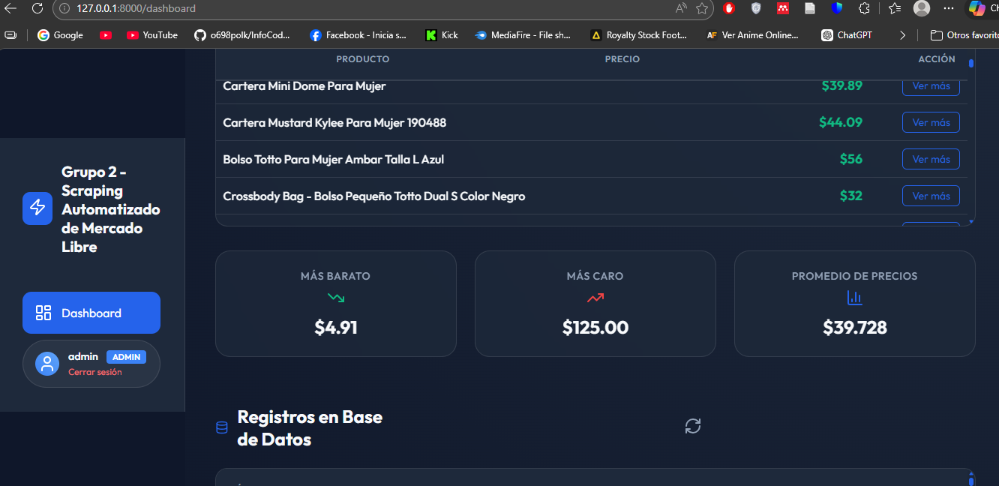
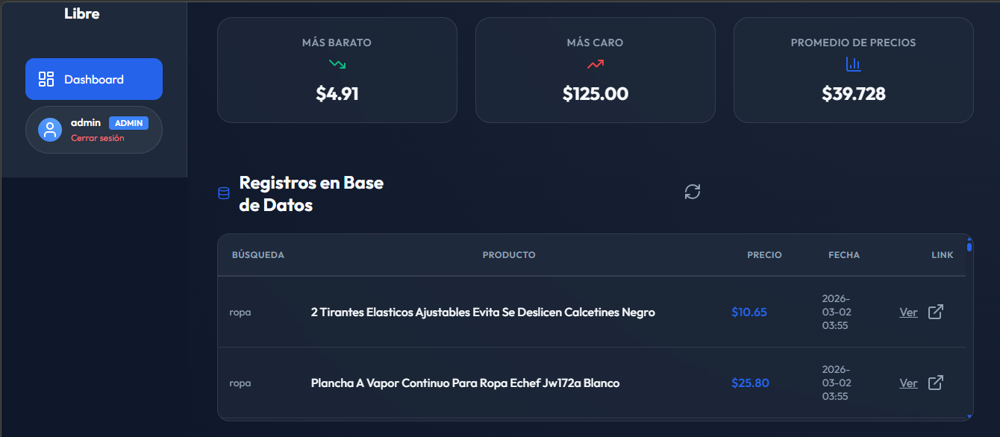

# Trabajo Grupal 2  
# Scraping Automatizado de Mercado Libre con Autenticación JWT

Se desarrollaron ambos ejercicios en una sola aplicación, integrando los conceptos aprendidos durante las horas de clase. Como resultado, se creó una demo funcional de un sistema de scraping automatizado, aplicando buenas prácticas de estructuración, lógica de programación y manejo de datos.

Aplicación web desarrollada en **Python** que implementa autenticación mediante **JWT**, realiza scraping automatizado en **Mercado Libre**, obtiene información de los primeros 5 resultados de búsqueda y almacena los datos en una base de datos **PostgreSQL** para su posterior consulta por parte del usuario.

---

##  Integrantes

- Héctor Ramos Vera  
- David León Guaman  
- Polk Brando Vernaza  

---
# Construcción del API
##  Creación del Proyecto y Repositorio en GitHub

Se creó el repositorio para el control de versiones y el trabajo colaborativo del equipo.



---

##  Configuración con Docker Compose

Se utilizó **docker-compose** para crear y configurar la imagen de **PostgreSQL**, definiendo:

- Variables de entorno
- Puerto de conexión
- Persistencia de datos



---

##  Archivo `requirements.txt`

Se generó el archivo `requirements.txt`, donde se agregaron todas las librerías necesarias para el funcionamiento del proyecto en Python.


---

##  Configuración de Base de Datos y Autenticación

Se realizó:

- Configuración de PostgreSQL  
- Creación del usuario administrador  
- Definición de modelos (ORM)  
- Configuración de JWT para el sistema de login  
- Conexión al puerto asignado  



---

##  Pruebas de Endpoints con curl

Se realizaron pruebas de funcionamiento mediante `curl`, validando los siguientes endpoints:

- `/` (Home)  
- `/login`  
- `/logout`  

Verificando la correcta generación y validación del token JWT.


---
# Web Scrapping
## Elegir una página pública
- https://listado.mercadolibre.com.ec/
##  Implementación del Scraping

### 1️ Análisis Inicial con Notebook

Se utilizó un Notebook para analizar la estructura HTML de Mercado Libre y comprender cómo se presentan los datos en la página.



---

### 2️ Extracción y Procesamiento de Datos

Una vez identificados los elementos necesarios, se extrajeron:

- Nombre del producto  
- Precio  
- Enlace  
- Información relevante  

Inicialmente los datos fueron procesados y almacenados en un archivo CSV para pruebas.



---

### 3️ Automatización del Scraping

Posteriormente se creó el archivo:

```
scraping.py
```

Este script automatiza:

- La búsqueda del producto  
- La obtención de los primeros 5 resultados  
- El procesamiento de datos  
- El almacenamiento en PostgreSQL  

#### Función del scraping automatizado



---

##  Desarrollo del Frontend

Una vez implementado el scraping, se desarrolló la interfaz gráfica del sistema.

---

###  Login

Pantalla de autenticación segura mediante JWT.



---

###  Dashboard

Panel principal donde el usuario puede:

- Realizar búsquedas  
- Visualizar resultados  
- Consultar registros almacenados  



---

###  Resultados de Búsqueda

Visualización de los productos obtenidos mediante scraping y almacenados en la base de datos.





---

##  Estado del Proyecto

- ✔ Proyecto culminado  
- ✔ Solución tecnológica funcional  
- ✔ Demo operativa  
- ✔ Pruebas realizadas en entorno local  
- ✔ Integración completa de backend, base de datos, scraping y frontend  

---

##  Conclusión

El proyecto integra tecnologías modernas como **FastAPI, Docker, JWT y PostgreSQL**, junto con técnicas de **web scraping**, permitiendo desarrollar una solución completa, funcional y estructurada bajo buenas prácticas de desarrollo.